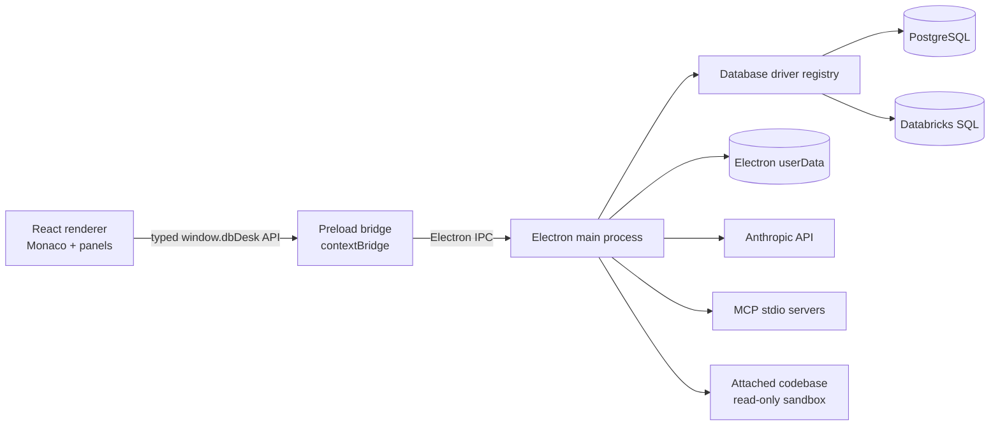

# DB Desk Technical Architecture

DB Desk is an Electron application written in TypeScript and React. It uses
electron-vite to build three runtime targets: the privileged Electron main
process, a sandboxed preload bridge, and the browser-based renderer.

Return to the [main README](../README.md), or see the
[user guide](user-guide.md) for product behavior.

## Runtime overview



### Main process

`src/main/` owns every privileged operation: application lifecycle, database
connections, filesystem persistence, native dialogs, exports, AI requests,
MCP child processes, and sandboxed codebase access. Database driver instances
and connection pools are keyed by connection ID and never exposed directly to
the renderer.

### Preload bridge

`src/preload/index.ts` exposes an immutable, typed `window.dbDesk` API through
Electron `contextBridge`. It translates renderer calls into named IPC requests
and converts main-process push events into unsubscribeable listeners.

The browser window enables context isolation and the Electron sandbox and
disables Node integration. This keeps the React layer from importing Node or
Electron primitives directly.

### Renderer

`src/renderer/src/` is a React 19 application. `App.tsx` composes the
connection tree, editor/results workspace, and multi-tab right panel and owns
state shared between them, such as query targets, agent context, and knowledge
navigation. Feature-specific hooks manage connection, file, query, knowledge,
and skill state.

Monaco is bundled locally rather than loaded from a CDN. Its workers are
included by Vite, which keeps editor functionality available in compiled
Electron builds without a network dependency.

## Important request flows

### Database query

1. The renderer identifies the active file, target, selection or statement at
   the cursor, and automatic row limit.
2. The preload bridge invokes `db:query` with structured-clone-safe values.
3. `src/main/db.ts` routes the request to the driver registered for the saved
   connection type.
4. The driver executes the statement and normalizes cells, fields, timing,
   command information, limits, and errors into shared wire types.
5. `useQueryRunner` turns the response into a live, pinned, preview, or AI
   result tab.

Exporting CSV or TSV without selected rows uses a separate `db:queryForExport`
IPC path. It reruns the statement with no grid limit and with the main-process
read-only option enabled before writing through a tokenized native save flow.

### Schema introspection

Drivers return the engine-neutral `DatabaseIntrospection` shape from
`src/shared/db.ts`. The renderer turns this into tree nodes and builds cached
reference indexes. PostgreSQL provides the detailed object categories and
foreign-key metadata used for FK/LFK navigation. Databricks catalogs are
represented as lazy top-level database nodes and loaded on expansion.

### AI turn

1. The renderer sends the target, model, reasoning effort, access mode,
   toggles, active editor snapshot, selection, and attached context.
2. `src/main/agent.ts` reloads `CLAUDE_API_KEY`, assembles dialect guidance,
   schema and knowledge context, and the available tool definitions.
3. The Anthropic response streams back through `agent:event` messages.
4. Tool calls are executed only in the main process. SQL tools pass through
   the agent read-only classifier and database driver safeguards; knowledge,
   repository, web, editor, and MCP tools have their own boundaries.
5. The renderer updates the transcript, result tabs, knowledge citations, or
   editor diff from those events.

The system prompt and conversation prefix use Anthropic prompt caching. Long
conversations can be compacted by asking the model for a replacement summary.

## Database abstraction

`src/main/drivers/types.ts` defines the `Driver` contract:

- test and establish connections;
- disconnect one or all connection IDs;
- introspect a database or catalog;
- execute normalized queries with optional read-only, timeout, and cancel
  controls; and
- provide detailed relation descriptions and schema search for agent tools.

`src/main/db.ts` is the engine-agnostic dispatcher. Engine differences shared
with the UI and agent live in `src/shared/dialect.ts`, including form fields,
defaults, database terminology, multi-database behavior, SQL guidance, and
`EXPLAIN` syntax.

To add an engine, implement the driver contract, register it with the main
dispatcher, add its dialect metadata, and extend the shared connection-type
union and tests. Keeping engine-specific behavior behind these two registries
prevents database conditionals from spreading through the renderer.

## Source layout

```text
src/
  main/
    index.ts              Electron lifecycle, BrowserWindow, core IPC handlers
    db.ts                 Database-driver dispatcher and agent DB operations
    drivers/
      types.ts            Driver interface
      postgres.ts         PostgreSQL pools, introspection, query safeguards
      databricks.ts       Databricks SQL sessions and introspection
    store.ts              Saved connection profiles and encrypted secrets
    files.ts              Persistent editor files and metadata
    dataExport.ts         Native export destinations and tokenized writes
    agent.ts              Anthropic streaming loop, prompts, and built-in tools
    mcp.ts                MCP server persistence, processes, and tool calls
    knowledge.ts          Knowledge bases, links, record CRUD, validation, v1 migration
    exemplar.ts           Exemplar-reference extraction
    repo.ts               Attached-repository persistence and read sandbox
    skills.ts             Custom skills and built-in skill overrides
  preload/
    index.ts              Typed, immutable window.dbDesk IPC bridge
  shared/
    db.ts                 Database and query wire types
    dialect.ts            Engine registry and dialect behavior
    sql.ts                Statement parsing, classification, and auto-limit logic
    agent.ts              Agent models, modes, requests, events, and context
    knowledge.ts          Knowledge record model and reverse usage index
    repo.ts               Repository tool types and scan prompts
    skills.ts             Skill model and installed built-ins
    files.ts              File kinds, extensions, and Monaco languages
    export.ts             Export format/result wire types
  renderer/src/
    App.tsx               Application shell and cross-panel coordination
    connections/          Connection dialog, schema tree, filtering, references
    components/           Editor, results, AI panel, files, previews, dialogs
    files/                Persistent file state hook
    knowledge/            Knowledge list, editors, references, and badges
    skills/               Skills list/editor and state hook
    sql/                  Renderer SQL analysis, highlighting, and completions
test/
  unit/                   Docker-free Vitest coverage
  integration/            Live-driver PostgreSQL tests
  seed/                   Disposable test schema and data
  docker-compose.yml      PostgreSQL 17 integration service
```

## Core dependencies

| Dependency                             | Role                                                                        |
| -------------------------------------- | --------------------------------------------------------------------------- |
| Electron                               | Desktop lifecycle, windows, IPC, native dialogs, and `safeStorage`.         |
| React / React DOM                      | Renderer component and state model.                                         |
| TypeScript                             | Static types across all three runtime targets.                              |
| electron-vite / Vite                   | Development server and separate main, preload, and renderer builds.         |
| Monaco Editor / `@monaco-editor/react` | Editing, syntax support, commands, and inline changes.                      |
| `pg`                                   | PostgreSQL pools, introspection, execution, cancel, and read-only sessions. |
| `@databricks/sql`                      | Databricks SQL warehouse sessions and queries.                              |
| `@anthropic-ai/sdk`                    | Streaming agent requests, prompt caching, and web-search integration.       |
| `@modelcontextprotocol/sdk`            | MCP stdio client transports and external tool discovery/calls.              |
| Vitest                                 | Unit and integration test projects.                                         |
| ESLint / Prettier                      | Static checks and repository formatting.                                    |

Exact versions are locked in `package-lock.json`.

## Persistence

All application-managed state is below Electron's `app.getPath('userData')`.
The main process owns these paths; the renderer works only with IDs and public
metadata.

| Data            | Location below `userData`              | Notes                                                                                 |
| --------------- | --------------------------------------- | ------------------------------------------------------------------------------------- |
| Connections     | `connections.json`                      | Versioned; mode `0600`; secrets encrypted with `safeStorage`; URL passwords redacted. |
| Files           | `queries/` and `queries/metadata.json`  | File contents plus connection/database ownership and names.                           |
| Knowledge bases | `knowledge/bases/<kbId>.json`           | Pretty-printed, versioned base metadata (name, codebase root) plus records; no secrets. |
| Knowledge links | `knowledge/links.json`                  | Attaches bases to (connection, database) targets, optionally scoped to one schema.    |
| Skills          | `skills.json`                           | Custom skills and edits to installed built-ins.                                       |
| MCP servers     | `mcp-servers.json`                      | Mode `0600`; environment map encrypted when possible.                                 |

Knowledge bases are free-standing: one base (typically per code repository,
with the attached codebase root stored on the base itself) can be linked to
several connections — prod, staging, and dev copies of one database — and one
database can be linked to several bases. Schema-scoped links attach a base to
a single schema of a multi-schema catalog. A pre-existing v1 layout
(`knowledge/<connId>/<databaseSlug>.json` plus `repo-roots.json`) is migrated
to bases and links once at startup, with originals preserved under
`knowledge/legacy-v1/`.

Connection removal cascades through files, knowledge *links*, and
connection-scoped skills; knowledge bases themselves survive so shared and
orphaned bases can be relinked or deleted explicitly. Built-in skill bodies
live in source; only edited overrides are persisted, so an application update
can change unedited built-ins.

Knowledge and skill stores use temporary-file-plus-rename writes to reduce the
risk of truncating user-authored content. Unreadable skill or knowledge files
are quarantined instead of silently overwritten.

## Security boundaries

### Electron boundary

The BrowserWindow uses `contextIsolation: true`, `nodeIntegration: false`, and
`sandbox: true`. Navigation is restricted to the development renderer origin
or compiled `file://` application; external links open in the system browser.
The preload surface is explicit rather than exposing generic IPC.

### Credential storage

Saved connection passwords/tokens are encrypted with Electron `safeStorage`
and never returned to the renderer. If encryption is unavailable, connection
secrets are not persisted. MCP environment values also use `safeStorage`, but
the MCP store retains a plaintext fallback when encryption is unavailable;
the containing file is restricted to the owner where the filesystem supports
POSIX modes.

### Agent database access

Metadata Only exposes no database execution tool. Read-Only accepts one
statement per call and allowlists read shapes such as `SELECT`, `WITH`,
`SHOW`, `DESCRIBE`, and `EXPLAIN` of reads. Calls use a timeout and return their
results to visible pinned tabs. PostgreSQL adds `default_transaction_read_only`
server-side; Databricks relies on statement classification. Write/Admin is
disabled. A least-privilege database role remains the strongest outer control.

### Codebase sandbox

Repository roots are selected with a native main-process dialog. Agent paths
must remain lexically and physically under the saved root. The implementation
rejects absolute and parent-traversal paths, does not follow symlinks, hides
common credential files, skips dot/generated/vendor directories, detects
binary files, and caps visits, results, matches, file sizes, lines, and
characters.

### MCP boundary

MCP servers are user-supplied local child processes with their own credentials
and authority. Tool names are namespaced before being offered to the model,
and startup and tool calls have timeouts. Database access modes do not sandbox
MCP effects; users must evaluate each server command and credential scope.

## Testing strategy

`vitest.config.ts` defines two projects:

- **unit** runs `test/unit/**/*.test.ts` and colocated `src/**/*.test.ts` in a
  Node environment without Docker;
- **integration** runs serially against PostgreSQL because test files reseed a
  shared database.

Integration global setup starts `test/docker-compose.yml`, waits for the
healthcheck and a seeded query, and leaves the container running by default.
The schema and data in `test/seed/` exercise introspection, SQL classification,
read-only sessions, and role-based protection. Environment variables can point
the harness at another host/port or skip Docker entirely.

Before submitting a change, the usual verification sequence is:

```bash
npm run typecheck
npm run lint
npm run test:unit
npm run test:integration
npm run build
```

## Build configuration

`electron.vite.config.ts` defines independent main, preload, and renderer
entries. Main and preload dependencies are externalized; the renderer uses the
React Vite plugin and `src/renderer` as its root. `npm run build` first runs the
Node/main and renderer TypeScript projects, then emits compiled assets to
`out/`. `npm run preview` launches those assets.

The macOS-only `scripts/patch-dev-electron.sh` runs after installation and
before development. It updates the development Electron bundle's display name
and icon and re-signs the modified bundle so it can launch on macOS. The script
is a no-op on other operating systems.
